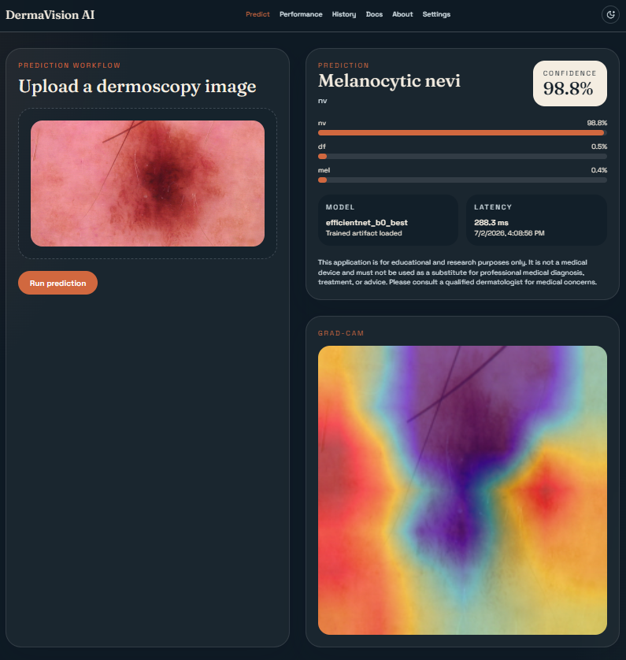
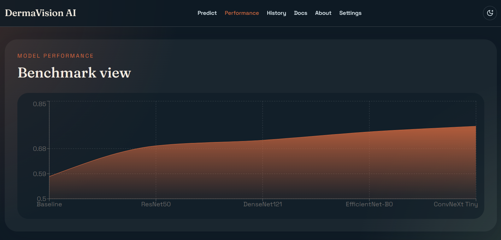

# DermaVision AI

DermaVision AI is a production-style skin lesion analysis project built around the HAM10000 dataset. It combines a PyTorch training pipeline, Grad-CAM explainability, a FastAPI inference backend, a React frontend, SQLite-backed prediction history, MLflow-ready experiment logging, Docker assets, CI, and project documentation.

This repository is for educational and research purposes only. It is not a medical device and must not be used for diagnosis, treatment, or medical advice.

## Screenshot

Prediction workflow and Grad-CAM result view:



Model performance dashboard:



## Architecture

```text
React Frontend
    |
    v
FastAPI Backend
    |
    v
Inference Service
    |
    v
Preprocessing + Optional Segmentation Crop
    |
    v
PyTorch Classifier
    |
    v
Grad-CAM + Persistence + Metrics
```

## Repository Layout

```text
backend/              FastAPI app, routes, DB, metrics
frontend/             React + Vite + Tailwind UI
src/dermavision_ai/   Core ML, data, training, inference, explainability code
configs/              YAML configuration
docs/                 Architecture and operation guides
notebooks/            Research and analysis notebooks
reports/              Generated and authored report artifacts
scripts/              Training, evaluation, export CLIs
tests/                Unit and API tests
```

## Dataset Setup

You must download and place the dataset locally before running training, inference, Docker, or the one-command pipeline. The project will not run correctly without the HAM10000 files under `data/`.

The code auto-detects HAM10000 under `data/` and `data/archive/`.

Expected local files:

- `data/archive/HAM10000_metadata.csv`
- `data/archive/HAM10000_images_part_1/`
- `data/archive/HAM10000_images_part_2/`
- optional segmentation directories containing `segment` in the directory name

Download the dataset before running the project:

- Kaggle: `https://www.kaggle.com/datasets/kmader/skin-cancer-mnist-ham10000?resource=download`
- Python:

```python
import kagglehub

path = kagglehub.dataset_download("kmader/skin-cancer-mnist-ham10000")
print(path)
```

After downloading, place the extracted files so the repository contains:

```text
data/archive/HAM10000_metadata.csv
data/archive/HAM10000_images_part_1/
data/archive/HAM10000_images_part_2/
```

Optional segmentation masks can also be added under `data/archive/` in a folder containing `segment` in its name.

Do this before:

- `poetry run dermavision-train`
- `poetry run uvicorn backend.main:app --reload`
- `docker compose up --build`
- `.\run_full_pipeline.cmd`

## Installation

### Backend and ML stack

1. Install Poetry.
2. Run `poetry install`.
3. Copy `.env.example` to `.env` if you want to override defaults.

### Frontend

1. `cd frontend`
2. `npm install`

## One-Command Runner

If you want one file to handle the whole workflow on Windows, run:

```powershell
.\run_full_pipeline.cmd
```

What it does:

- creates `.env` from `.env.example` if needed
- installs Poetry and backend dependencies
- installs frontend dependencies
- runs backend tests
- trains the model
- runs evaluation
- exports TorchScript and ONNX artifacts
- starts the FastAPI backend and React frontend in new terminal windows

Useful flags:

- `.\run_full_pipeline.cmd --skip-install`
- `.\run_full_pipeline.cmd --skip-tests`
- `.\run_full_pipeline.cmd --skip-training`
- `.\run_full_pipeline.cmd --skip-evaluation`
- `.\run_full_pipeline.cmd --skip-export`
- `.\run_full_pipeline.cmd --no-servers`

Example:

```powershell
.\run_full_pipeline.cmd --skip-install --skip-training
```

## Training

Run:

```bash
poetry run dermavision-train
```

Outputs:

- best checkpoint in `models/checkpoints/`
- MLflow run in `mlruns/`

For local single-machine runs, the project automatically enables MLflow's file-store compatibility mode for the default `mlruns/` tracking directory.

## Evaluation

Run:

```bash
poetry run dermavision-evaluate
```

This exports evaluation figures such as the confusion matrix to `reports/figures/`.

## Inference API

Start the backend:

```bash
poetry run uvicorn backend.main:app --reload
```

Key endpoints:

- `GET /health`
- `GET /version`
- `GET /model-info`
- `GET /metrics`
- `GET /history`
- `POST /predict`
- `POST /predict/batch`

Swagger UI is available at `/docs`.

If no checkpoint exists yet, the backend still starts and reports `model_ready: false` so the UI and API remain inspectable.

## Frontend

Start the frontend:

```bash
cd frontend
npm run dev
```

By default it targets `http://localhost:8000`. Override with `VITE_API_URL`.

Pages included:

- Landing
- Prediction
- About
- Documentation
- Model Performance
- History
- Settings

## Docker

Run the full stack:

```bash
docker compose up --build
```

Services:

- `api` on port `8000`
- `frontend` on port `5173`
- `mlflow` on port `5000`

## Quality and Tooling

- Linting: `poetry run ruff check .`
- Tests: `poetry run pytest`
- Type checking: `poetry run mypy src backend tests scripts`
- Pre-commit: `pre-commit install`

## Documentation

See:

- [Architecture](docs/architecture.md)
- [API Guide](docs/api.md)
- [Training Guide](docs/training_guide.md)
- [Deployment Guide](docs/deployment_guide.md)
- [Troubleshooting](docs/troubleshooting.md)
- [Developer Guide](docs/developer_guide.md)
- [User Manual](docs/user_manual.md)
- [Dataset Card](docs/dataset_card.md)
- [Model Card](docs/model_card.md)

## Deployment Targets

This repository is structured to support:

- Docker
- Render
- Railway
- AWS EC2
- Google Cloud Run

## Roadmap

- Add Optuna study orchestration and persistence scripts
- Add segmentation mask training when the segmentation dataset is present locally
- Add richer frontend report downloads
- Add ONNX Runtime inference path in the API

## Acknowledgements

- HAM10000 dataset authors
- Kaggle dataset maintainers
- PyTorch, FastAPI, React, Tailwind, MLflow, and DVC communities
